# Algorithm Examples - Design of Experiments

This document demonstrates all nineteen maze generation algorithms using a Design of Experiments (DOE) approach. All parameters except the algorithm are held constant to clearly show how each algorithm affects the maze structure and solution path.

## Experimental Design

### Fixed Parameters
- **Seed**: 12345 (for reproducibility)
- **Maze Size**: 50×50 cells (medium)
- **Image Size**: 250×250 pixels (cell_size = 5)
- **Complexity Values**: 0.0, 0.5, 1.0

### Variable Parameter
- **Algorithm**: Nineteen different maze generation algorithms

### Experimental Matrix

| Algorithm | Complexity 0.0 | Complexity 0.5 | Complexity 1.0 |
|-----------|----------------|----------------|----------------|
| Recursive Backtracking | ✓ | ✓ | ✓ |
| Kruskal | ✓ | ✓ | ✓ |
| Prim | ✓ | ✓ | ✓ |
| Aldous-Broder | ✓ | ✓ | ✓ |
| Wilsons | ✓ | ✓ | ✓ |
| Recursive Division | ✓ | ✓ | ✓ |
| Growing Tree | ✓ | ✓ | ✓ |
| Hunt and Kill | ✓ | ✓ | ✓ |
| Binary Tree | ✓ | ✓ | ✓ |
| Sidewinder | ✓ | ✓ | ✓ |
| Eller | ✓ | ✓ | ✓ |
| DFS Iterative | ✓ | ✓ | ✓ |
| BFS | ✓ | ✓ | ✓ |
| Recursive Backtracking Braided | ✓ | ✓ | ✓ |
| Cellular Automata | ✓ | ✓ | ✓ |
| Drunkard's Walk | ✓ | ✓ | ✓ |
| Random Obstacle | ✓ | ✓ | ✓ |
| Hamiltonian | ✓ | ✓ | ✓ |
| Voronoi | ✓ | ✓ | ✓ |

**Total Combinations**: 19 algorithms × 3 complexity values = 57 mazes

## Results by Complexity Level

### Complexity 0.0

At minimum complexity, the algorithms show their baseline characteristics:

#### Recursive Backtracking
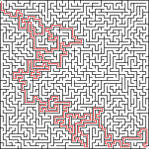

#### Kruskal
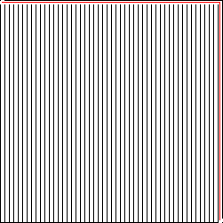

#### Prim
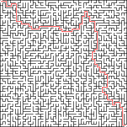

#### Aldous-Broder
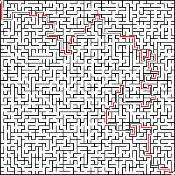

#### Wilsons


#### Recursive Division
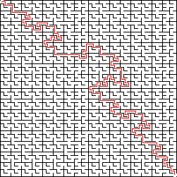

#### Growing Tree
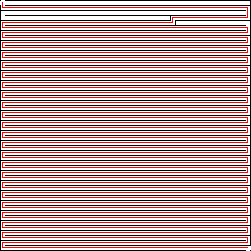

#### Hunt and Kill
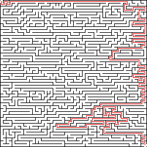

#### Binary Tree


#### Sidewinder
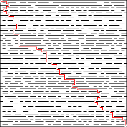

#### Eller


#### DFS Iterative


#### BFS
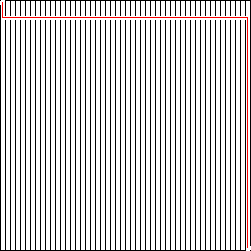

#### Recursive Backtracking Braided


#### Cellular Automata
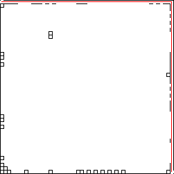

#### Drunkard's Walk
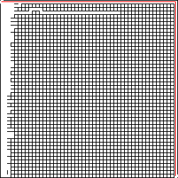

#### Random Obstacle
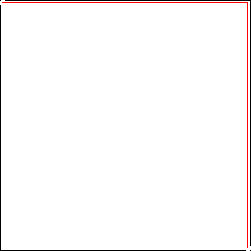

#### Hamiltonian
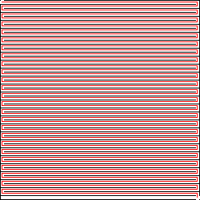

#### Voronoi
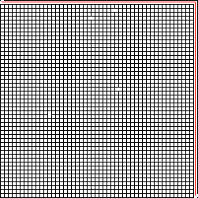

---

### Complexity 0.5

At medium complexity, the algorithms demonstrate balanced maze characteristics:

#### Recursive Backtracking
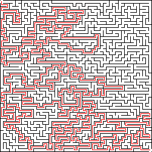

#### Kruskal
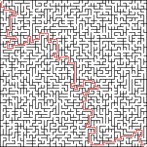

#### Prim


#### Aldous-Broder
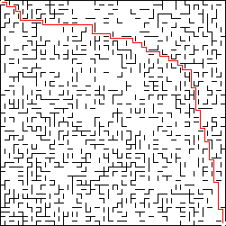

#### Wilsons
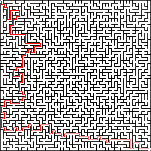

#### Recursive Division
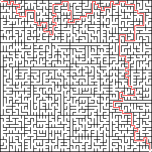

#### Growing Tree
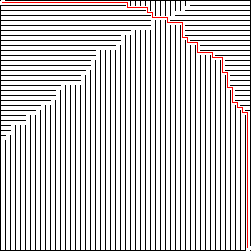

#### Hunt and Kill


#### Binary Tree
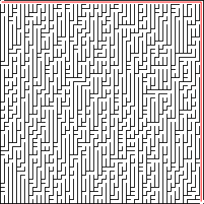

#### Sidewinder
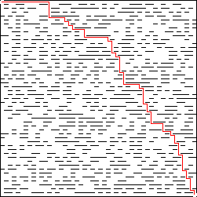

#### Eller


#### DFS Iterative


#### BFS
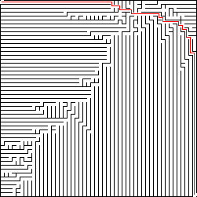

#### Recursive Backtracking Braided
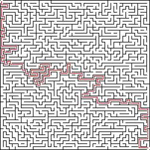

#### Cellular Automata
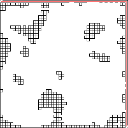

#### Drunkard's Walk
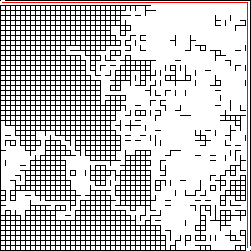

#### Random Obstacle
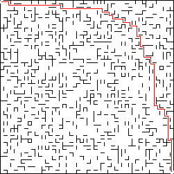

#### Hamiltonian


#### Voronoi
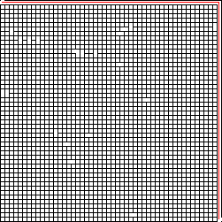

---

### Complexity 1.0

At maximum complexity, the algorithms show their most complex maze structures:

#### Recursive Backtracking
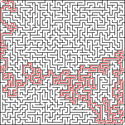

#### Kruskal
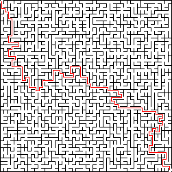

#### Prim
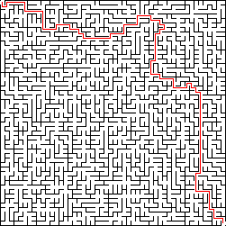

#### Aldous-Broder
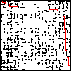

#### Wilsons


#### Recursive Division
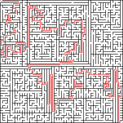

#### Growing Tree
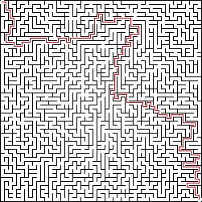

#### Hunt and Kill
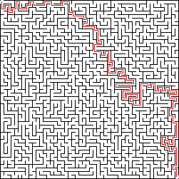

#### Binary Tree


#### Sidewinder
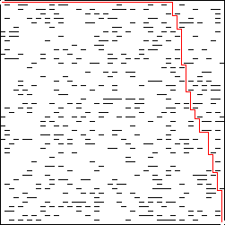

#### Eller
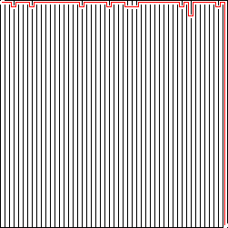

#### DFS Iterative
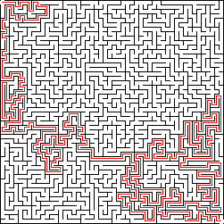

#### BFS
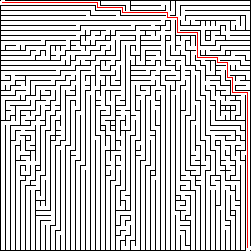

#### Recursive Backtracking Braided


#### Cellular Automata
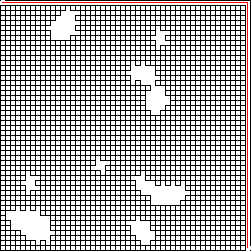

#### Drunkard's Walk
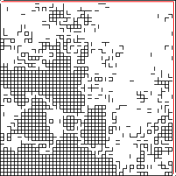

#### Random Obstacle


#### Hamiltonian


#### Voronoi
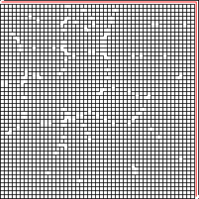

---

## Algorithm Characteristics

### Recursive Backtracking
- **Pattern**: Long, winding paths with deep branches
- **Solution Path**: Typically longer, more circuitous routes
- **Complexity Effect**: More pronounced branching at higher complexity

### Kruskal
- **Pattern**: More uniform distribution of paths
- **Solution Path**: Generally shorter, more direct routes
- **Complexity Effect**: Maintains uniform structure across complexity levels

### Prim
- **Pattern**: Tree-like structure growing from a single point
- **Solution Path**: Moderate length, follows tree branches
- **Complexity Effect**: Tree structure becomes more complex with higher complexity

### Aldous-Broder
- **Pattern**: Random walk creates varied path distributions
- **Solution Path**: Variable length depending on random walk pattern
- **Complexity Effect**: Random nature makes complexity effects less predictable

### Wilsons
- **Pattern**: Loop-erased random walk algorithm, creates uniform spanning trees
- **Solution Path**: Balanced path lengths with good connectivity
- **Complexity Effect**: Complexity affects the randomness of the walk

### Recursive Division
- **Pattern**: Divides space recursively, creating structured regions
- **Solution Path**: Paths follow division boundaries
- **Complexity Effect**: More divisions at higher complexity create more complex structures

### Growing Tree
- **Pattern**: Flexible algorithm that can mimic other algorithms based on selection method
- **Solution Path**: Varies based on tree growth pattern
- **Complexity Effect**: Complexity affects cell selection strategy

### Hunt and Kill
- **Pattern**: Combines random walk with systematic hunting for unvisited cells
- **Solution Path**: Mix of random and structured paths
- **Complexity Effect**: Complexity affects the balance between hunting and random walking

### Binary Tree
- **Pattern**: Creates a binary tree structure with clear directional bias
- **Solution Path**: Paths follow tree structure with predictable patterns
- **Complexity Effect**: Complexity affects tree branching decisions

### Sidewinder
- **Pattern**: Creates horizontal corridors with vertical connections
- **Solution Path**: Paths tend to follow horizontal then vertical movement
- **Complexity Effect**: Complexity affects the probability of creating new rows

### Eller
- **Pattern**: Row-by-row generation using union-find, efficient for large mazes
- **Solution Path**: Paths flow naturally across rows
- **Complexity Effect**: Complexity affects row connection decisions

### DFS Iterative
- **Pattern**: Depth-first search using explicit stack, similar to recursive backtracking
- **Solution Path**: Long paths with deep branches
- **Complexity Effect**: Similar to recursive backtracking, more branching at higher complexity

### BFS
- **Pattern**: Breadth-first search creates more uniform expansion
- **Solution Path**: Shorter, more direct paths from start to finish
- **Complexity Effect**: Complexity affects expansion priority

### Recursive Backtracking Braided
- **Pattern**: Similar to recursive backtracking but with loops (braids) added
- **Solution Path**: Multiple solution paths possible due to loops
- **Complexity Effect**: Higher complexity adds more braids/loops

### Cellular Automata
- **Pattern**: Uses cellular automata rules to evolve maze structure
- **Solution Path**: Organic, evolved path patterns
- **Complexity Effect**: Complexity affects initial density and iteration count

### Drunkard's Walk
- **Pattern**: Random walk until sufficient area is carved
- **Solution Path**: Meandering paths following random walk
- **Complexity Effect**: Complexity affects density threshold and walk behavior

### Random Obstacle
- **Pattern**: Places random obstacles in an open grid
- **Solution Path**: Paths navigate around obstacles
- **Complexity Effect**: Higher complexity adds more obstacles

### Hamiltonian
- **Pattern**: Creates a Hamiltonian path (visits every cell exactly once)
- **Solution Path**: Single path through entire maze
- **Complexity Effect**: Complexity affects path generation strategy

### Voronoi
- **Pattern**: Uses Voronoi diagrams to create region-based mazes
- **Solution Path**: Paths follow Voronoi cell boundaries
- **Complexity Effect**: Complexity affects number and distribution of Voronoi sites

## Observations

1. **Solution Path Length**: Different algorithms produce mazes with varying solution path lengths even with the same seed and complexity, demonstrating their inherent structural differences.

2. **Path Patterns**: Each algorithm creates distinct visual patterns:
   - **Tree-based algorithms** (Prim, Binary Tree, Growing Tree): Centralized structures with clear hierarchy
   - **Random walk algorithms** (Aldous-Broder, Wilsons, Drunkard's Walk): More organic, less predictable patterns
   - **Division algorithms** (Recursive Division, Eller): Structured, region-based patterns
   - **Graph-based algorithms** (Kruskal, BFS): More uniform, evenly distributed paths
   - **Specialized algorithms** (Cellular Automata, Voronoi, Hamiltonian): Unique patterns based on their specific techniques

3. **Complexity Impact**: The complexity parameter affects each algorithm differently:
   - Some algorithms show dramatic visual changes across the 0.0 to 1.0 range
   - Others maintain consistent structural characteristics with subtle variations
   - The impact depends on how each algorithm interprets and uses the complexity parameter

4. **Reproducibility**: Using the same seed (12345) ensures that any differences observed are due to the algorithm itself, not random variation.

5. **Algorithm Diversity**: The nineteen algorithms represent a wide range of maze generation philosophies:
   - **Classical algorithms**: Recursive Backtracking, Kruskal, Prim
   - **Random walk variants**: Aldous-Broder, Wilsons, Drunkard's Walk
   - **Efficient algorithms**: Eller (row-by-row), BFS, DFS Iterative
   - **Specialized techniques**: Cellular Automata, Voronoi, Hamiltonian
   - **Hybrid approaches**: Growing Tree, Hunt and Kill, Recursive Backtracking Braided

## Generating These Examples

To regenerate these examples with the same parameters:

```bash
# Ensure the binary is built
make release

# Generate all combinations
for algo in recursive_backtracking kruskal prim aldous_broder wilsons recursive_division growing_tree hunt_and_kill binary_tree sidewinder eller dfs_iterative bfs recursive_backtracking_braided cellular_automata drunkards_walk random_obstacle hamiltonian voronoi; do
  for complexity in 0.0 0.5 1.0; do
    ./target/release/maze_generator \
      --config config_doe.toml \
      --algorithm "$algo" \
      --complexity "$complexity" \
      --width 50 \
      --height 50 \
      --seed 12345 \
      --output ".img/${algo}_${complexity}.png"
  done
done
```

Or use the Makefile target:

```bash
make algorithm-examples
```

Note: The `config_doe.toml` file contains `cell_size = 5` to produce 250×250 pixel images for 50×50 cell mazes.
