# Complexity Parameter Examples - Design of Experiments

This document demonstrates the effect of the `complexity` parameter on maze generation using a Design of Experiments (DOE) approach. All examples use identical fixed parameters to isolate the impact of complexity variations.

## Experimental Design

### Fixed Parameters
- **Seed**: `12345` (ensures reproducibility across all examples)
- **Maze Size**: `50x50` cells (medium size)
- **Image Size**: `~100x100` pixels (`cell_size = 2`)
- **Algorithm**: Varied (one section per algorithm)

### Variable Parameter
- **Complexity**: `0.0` to `1.0` in steps of `0.1` (11 values total)

### Complexity Values Tested
`0.0`, `0.1`, `0.2`, `0.3`, `0.4`, `0.5`, `0.6`, `0.7`, `0.8`, `0.9`, `1.0`

---

## Recursive Backtracking Algorithm

Recursive Backtracking uses a depth-first search approach with backtracking. The complexity parameter affects the randomness in neighbor selection and path exploration.

### Complexity Progression

| Complexity | Unsolved Maze | Solved Maze |
|------------|---------------|-------------|
| 0.0 |  |  |
| 0.1 | 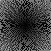 | 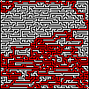 |
| 0.2 | 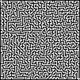 | 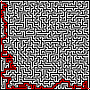 |
| 0.3 | 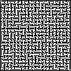 | 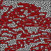 |
| 0.4 | 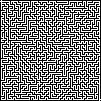 | 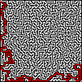 |
| 0.5 | 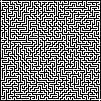 |  |
| 0.6 | 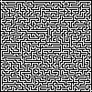 | 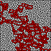 |
| 0.7 | 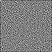 | 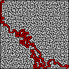 |
| 0.8 | 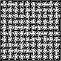 | 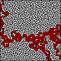 |
| 0.9 | 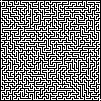 | 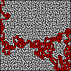 |
| 1.0 |  |  |

### Observations
- **Low Complexity (0.0-0.3)**: Produces more deterministic, structured mazes with predictable patterns
- **Medium Complexity (0.4-0.6)**: Balanced mix of structure and randomness
- **High Complexity (0.7-1.0)**: More random path selection, creating less predictable maze structures

---

## Kruskal's Algorithm

Kruskal's Algorithm uses a union-find data structure to randomly connect cells while ensuring no cycles. The complexity parameter affects edge shuffling and selection probability.

### Complexity Progression

| Complexity | Unsolved Maze | Solved Maze |
|------------|---------------|-------------|
| 0.0 |  | 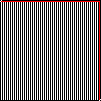 |
| 0.1 | 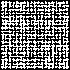 | 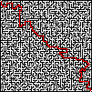 |
| 0.2 | 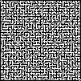 | 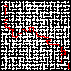 |
| 0.3 |  | 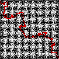 |
| 0.4 | 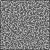 | 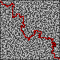 |
| 0.5 |  | 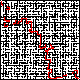 |
| 0.6 | 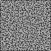 | 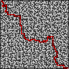 |
| 0.7 | 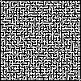 | 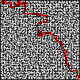 |
| 0.8 | 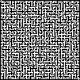 | 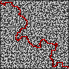 |
| 0.9 | 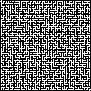 | 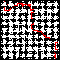 |
| 1.0 | 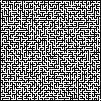 | 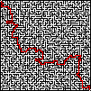 |

### Observations
- **Low Complexity (0.0-0.3)**: More uniform distribution with less edge filtering
- **Medium Complexity (0.4-0.6)**: Balanced edge selection and filtering
- **High Complexity (0.7-1.0)**: Increased randomness in edge processing, potentially creating more varied path structures

---

## Prim's Algorithm

Prim's Algorithm grows the maze from a single starting point, similar to Kruskal's but with a tree-like structure. The complexity parameter influences the randomness in frontier cell selection.

### Complexity Progression

| Complexity | Unsolved Maze | Solved Maze |
|------------|---------------|-------------|
| 0.0 | 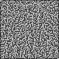 | 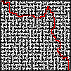 |
| 0.1 | 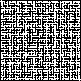 | 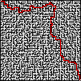 |
| 0.2 | 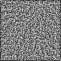 | 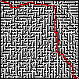 |
| 0.3 | 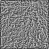 | 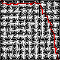 |
| 0.4 | 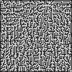 | 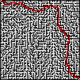 |
| 0.5 |  |  |
| 0.6 | 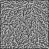 | 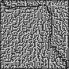 |
| 0.7 | 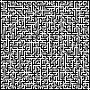 | 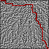 |
| 0.8 |  |  |
| 0.9 |  |  |
| 1.0 |  |  |

### Observations
- **Low Complexity (0.0-0.3)**: More deterministic growth pattern from the starting point
- **Medium Complexity (0.4-0.6)**: Balanced tree-like expansion
- **High Complexity (0.7-1.0)**: More random frontier selection, creating less predictable tree structures

---

## Aldous-Broder Algorithm

Aldous-Broder uses a random walk approach, visiting cells randomly until all cells have been visited. The complexity parameter affects the randomness in neighbor selection during the walk.

### Complexity Progression

| Complexity | Unsolved Maze | Solved Maze |
|------------|---------------|-------------|
| 0.0 |  |  |
| 0.1 |  |  |
| 0.2 |  |  |
| 0.3 |  |  |
| 0.4 |  |  |
| 0.5 |  |  |
| 0.6 |  |  |
| 0.7 |  |  |
| 0.8 |  |  |
| 0.9 |  |  |
| 1.0 |  |  |

### Observations
- **Low Complexity (0.0-0.3)**: More predictable random walk patterns
- **Medium Complexity (0.4-0.6)**: Balanced randomness in neighbor selection
- **High Complexity (0.7-1.0)**: Maximum randomness in walk direction, potentially creating more varied maze structures

---

## Generating the Images

To generate all the images referenced in this document, use the following command pattern:

```bash
# Example for Recursive Backtracking with complexity 0.0
./target/release/maze_generator \
  --width 50 \
  --height 50 \
  --algorithm recursive_backtracking \
  --complexity 0.0 \
  --seed 12345 \
  --output complexity_examples/recursive_backtracking_complexity_0.0.png

# The solved version will be automatically generated as:
# complexity_examples/recursive_backtracking_complexity_0.0_solved.png
```

**Note**: The `cell_size` parameter is not directly available via CLI. To achieve ~100x100 pixel images for a 50x50 maze, you would need to modify the `config.toml` file to set `cell_size = 2`, or modify the code to accept this parameter via CLI.

### Batch Generation Script

A script to generate all images would iterate through:
- 4 algorithms × 11 complexity values = 44 maze images (plus 44 solved versions = 88 total images)

---

## Summary

This Design of Experiments approach allows for systematic comparison of how the complexity parameter affects maze generation across all four algorithms. By keeping all other parameters constant (seed, size, image dimensions), we can isolate and observe the specific impact of complexity variations on the resulting maze structures.

### Key Findings (to be updated after image generation)

- Each algorithm responds differently to complexity changes
- Lower complexity values tend to produce more predictable, structured mazes
- Higher complexity values introduce more randomness and variation
- The optimal complexity value may depend on the desired maze characteristics and the algorithm used

