# Makefile Targets Documentation

This document provides a comprehensive guide to all available make targets in the maze generator project.

## Build Targets

### make release

Builds the release binary of the maze generator.

**Example:**
```bash
make release
```

**Output:** `target/release/maze_generator`

---

### make debug

Builds the debug binary of the maze generator.

**Example:**
```bash
make debug
```

**Output:** `target/debug/maze_generator`

---

## Benchmark Targets

### make benchmark

Runs the full benchmark suite to measure maze generation performance.

**Example:**
```bash
make benchmark
```

**Output:** Benchmark results displayed in terminal and saved to `target/criterion/`

---

### make benchmark-quick

Runs a quick benchmark suite with reduced sample size for faster results.

**Example:**
```bash
make benchmark-quick
```

**Output:** Quick benchmark results displayed in terminal

---

## Maze Generation Targets

### make maze

Generates the default maze using settings from `config.toml` and automatically creates both unsolved and solved versions.

**Example:**
```bash
make maze
```

**Output Files:**
- `maze.png` - Unsolved maze
- `maze_solved.png` - Solved maze with path highlighted

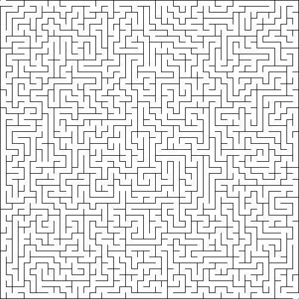

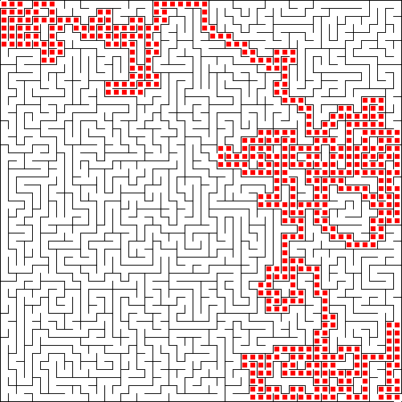

---

## Algorithm-Specific Targets

### make maze-recursive-backtracking

Generates a maze using the recursive backtracking algorithm.

**Example:**
```bash
make maze-recursive-backtracking
```

**Output Files:**
- `maze_recursive_backtracking.png` - Unsolved maze
- `maze_recursive_backtracking_solved.png` - Solved maze

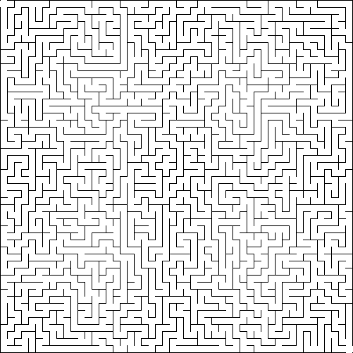

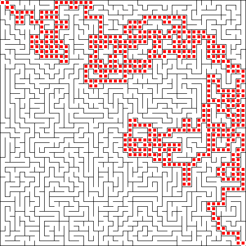

---

### make maze-kruskal

Generates a maze using Kruskal's algorithm.

**Example:**
```bash
make maze-kruskal
```

**Output Files:**
- `maze_kruskal.png` - Unsolved maze
- `maze_kruskal_solved.png` - Solved maze

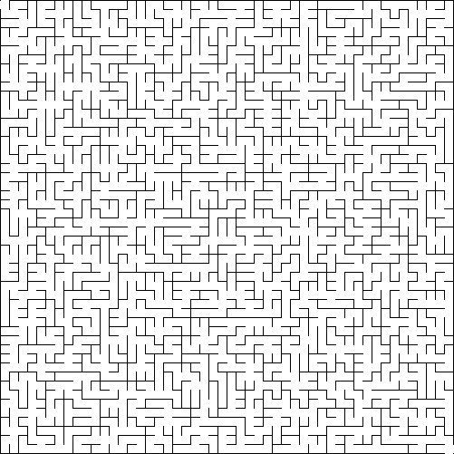


---

### make maze-prim

Generates a maze using Prim's algorithm.

**Example:**
```bash
make maze-prim
```

**Output Files:**
- `maze_prim.png` - Unsolved maze
- `maze_prim_solved.png` - Solved maze

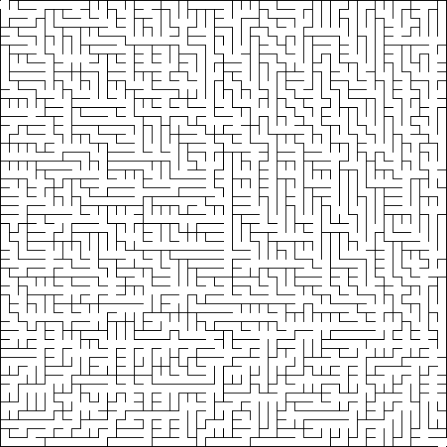

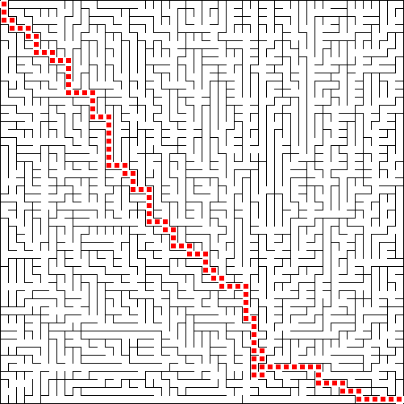

---

### make maze-aldous-broder

Generates a maze using the Aldous-Broder algorithm.

**Example:**
```bash
make maze-aldous-broder
```

**Output Files:**
- `maze_aldous_broder.png` - Unsolved maze
- `maze_aldous_broder_solved.png` - Solved maze

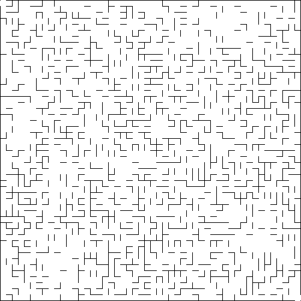

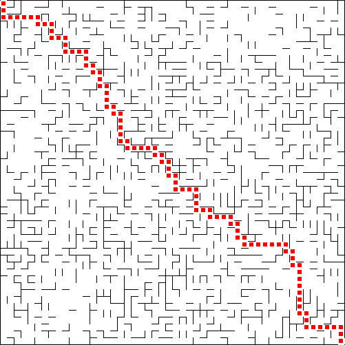

---

### make all-algorithms

Generates mazes using all available algorithms in one command.

**Example:**
```bash
make all-algorithms
```

**Output Files:** All algorithm-specific maze files (recursive_backtracking, kruskal, prim, aldous_broder) with their solved versions.

---

## Size Preset Targets

### make maze-small

Generates a small 20x20 cell maze.

**Example:**
```bash
make maze-small
```

**Output Files:**
- `maze_small.png` - Unsolved maze
- `maze_small_solved.png` - Solved maze

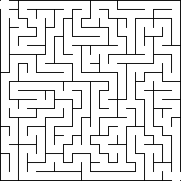

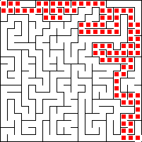

---

### make maze-medium

Generates a medium 50x50 cell maze.

**Example:**
```bash
make maze-medium
```

**Output Files:**
- `maze_medium.png` - Unsolved maze
- `maze_medium_solved.png` - Solved maze

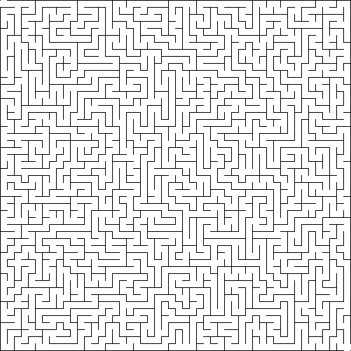

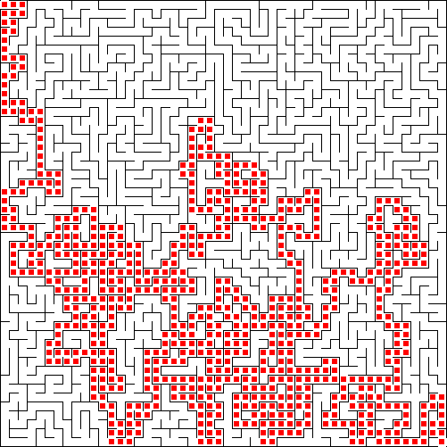

---

### make maze-large

Generates a large 100x100 cell maze.

**Example:**
```bash
make maze-large
```

**Output Files:**
- `maze_large.png` - Unsolved maze
- `maze_large_solved.png` - Solved maze

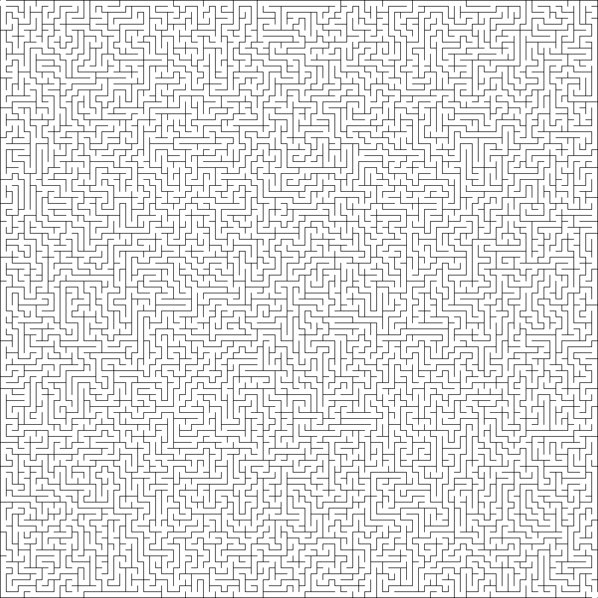

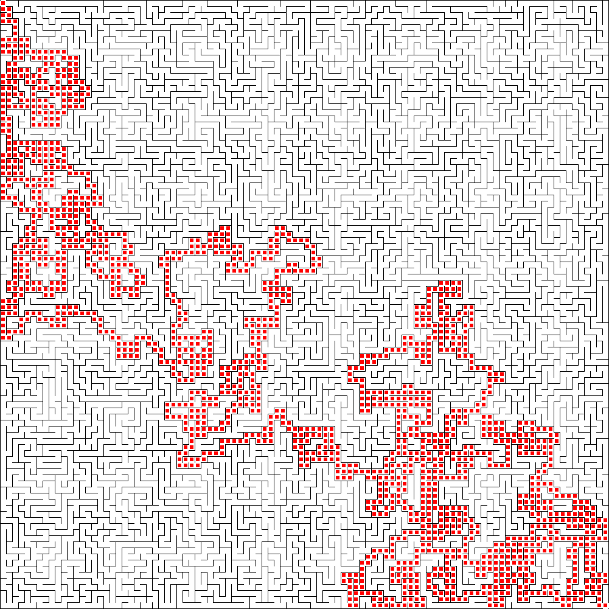

---

### make maze-huge

Generates a huge 200x200 cell maze.

**Example:**
```bash
make maze-huge
```

**Output Files:**
- `maze_huge.png` - Unsolved maze
- `maze_huge_solved.png` - Solved maze


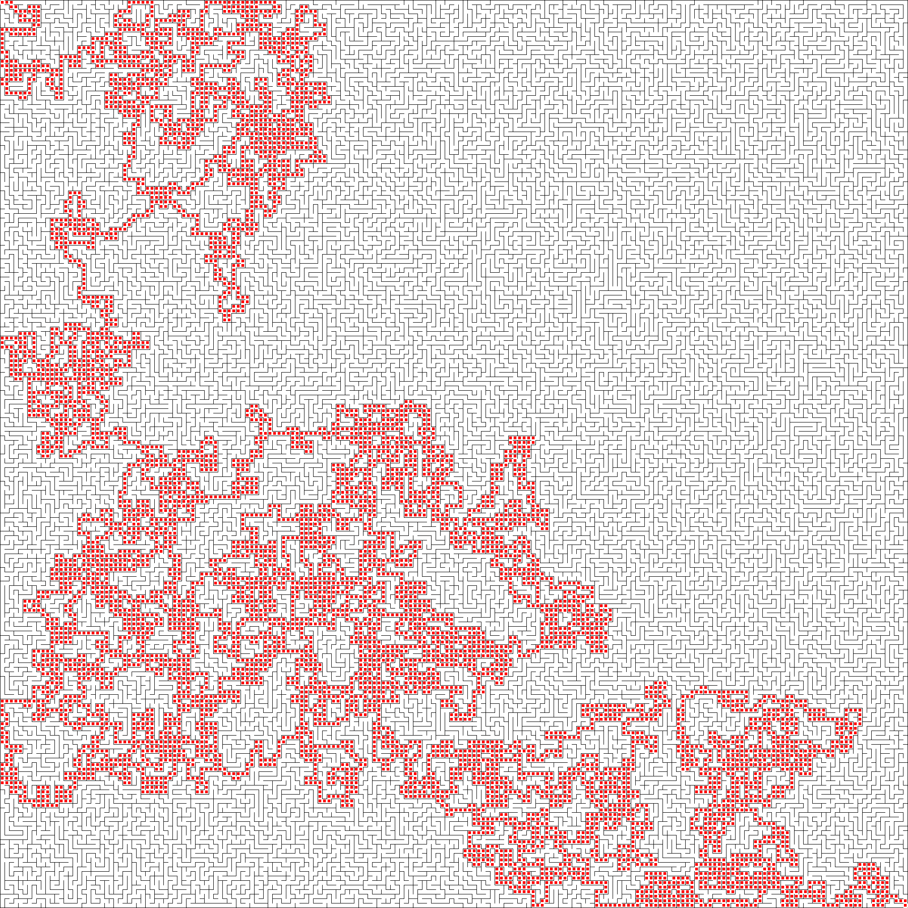

---

## Complexity Variation Targets

### make maze-simple

Generates a maze with low complexity (0.1).

**Example:**
```bash
make maze-simple
```

**Output Files:**
- `maze_simple.png` - Unsolved maze
- `maze_simple_solved.png` - Solved maze

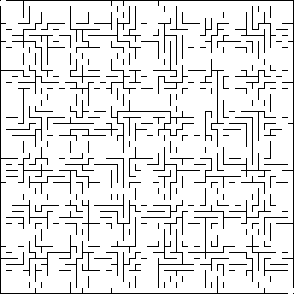

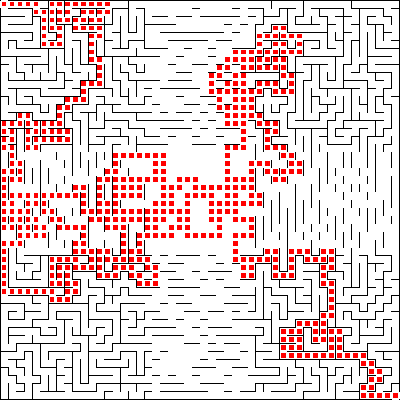

---

### make maze-normal

Generates a maze with normal complexity (0.5).

**Example:**
```bash
make maze-normal
```

**Output Files:**
- `maze_normal.png` - Unsolved maze
- `maze_normal_solved.png` - Solved maze

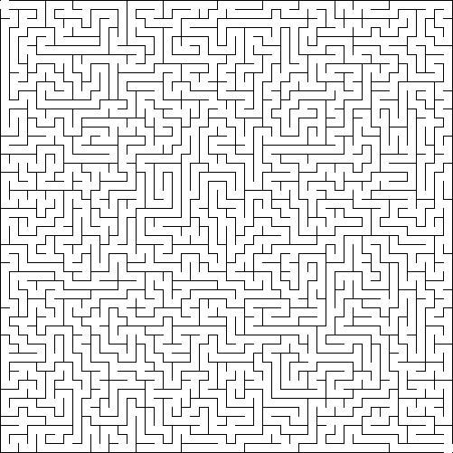

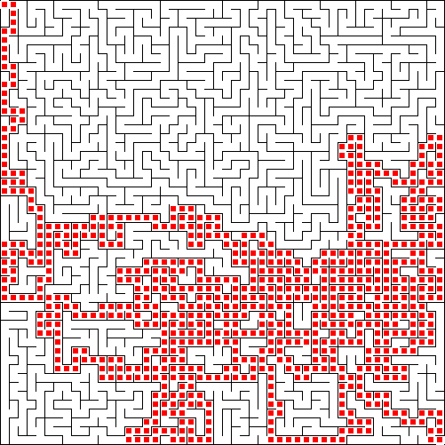

---

### make maze-complex

Generates a maze with high complexity (0.9).

**Example:**
```bash
make maze-complex
```

**Output Files:**
- `maze_complex.png` - Unsolved maze
- `maze_complex_solved.png` - Solved maze

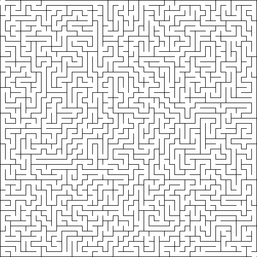

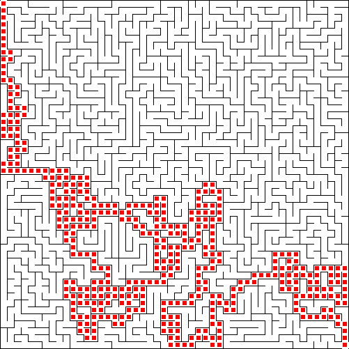

---

## Combined Targets

### make all-mazes

Generates all maze variations in one command. This includes:
- Default maze
- All algorithm-specific mazes (recursive_backtracking, kruskal, prim, aldous_broder)
- All size presets (small, medium, large, huge)
- All complexity variations (simple, normal, complex)

**Example:**
```bash
make all-mazes
```

**Output Files:** All maze files generated by the individual targets listed above.

---

## Clean Targets

### make clean

Removes all build artifacts (compiled binaries and intermediate files).

**Example:**
```bash
make clean
```

**Effect:** Removes `target/` directory contents

---

### make clean-outputs

Removes all generated PNG maze files.

**Example:**
```bash
make clean-outputs
```

**Effect:** Removes all `*.png` maze files from the project directory

---

### make clean-all

Removes both build artifacts and all generated maze files.

**Example:**
```bash
make clean-all
```

**Effect:** Removes both `target/` directory and all `*.png` maze files

---

## Help Target

### make help

Displays a summary of all available make targets.

**Example:**
```bash
make help
```

**Output:** Lists all targets with brief descriptions

