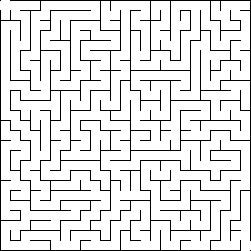
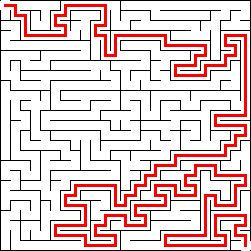

# Maze Generator (Rust)

A high-performance maze generator written in Rust that supports multiple generation algorithms and automatically solves generated mazes.

> **Note:** This project was a demo generated at the GRPUG (Grand Rapids Python Users Group) meeting on December 15, 2025.

## Features

- **Multiple Algorithms**: Supports four different maze generation algorithms:
  - Recursive Backtracking
  - Kruskal's Algorithm
  - Prim's Algorithm
  - Aldous-Broder Algorithm

- **Automatic Solving**: Automatically solves generated mazes using BFS (Breadth-First Search)

- **Configurable**: Adjustable maze dimensions, complexity, and algorithm selection

- **Reproducible**: Optional seed support for reproducible maze generation

- **High Performance**: Optimized Rust implementation with benchmarking support

- **Visual Output**: Generates PNG images of both unsolved and solved mazes

## Installation

### Prerequisites

- Rust toolchain (1.70+)
- Cargo (comes with Rust)

### Build

```bash
# Build release binary
cargo build --release

# Or use make
make release
```

The binary will be located at `target/release/maze_generator`.

## Usage

### Command Line

```bash
# Generate a maze with default settings (from config.toml)
./target/release/maze_generator

# Generate a maze with custom dimensions
./target/release/maze_generator --width 100 --height 100

# Generate using a specific algorithm
./target/release/maze_generator --algorithm kruskal

# Generate with custom complexity (0.0 to 1.0)
./target/release/maze_generator --complexity 0.8

# Generate with a seed for reproducibility
./target/release/maze_generator --seed 12345

# Specify output file
./target/release/maze_generator --output my_maze.png
```

### Makefile Targets

For a comprehensive list of all available make targets with examples, see [MAKEFILE_TARGETS.md](MAKEFILE_TARGETS.md).

Quick examples:

```bash
# Generate default maze
make maze

# Generate all maze variations
make all-mazes

# Generate maze with specific algorithm
make maze-kruskal

# Generate different sizes
make maze-small    # 20x20
make maze-medium   # 50x50
make maze-large    # 100x100
make maze-huge     # 200x200

# Generate different complexities
make maze-simple   # complexity 0.1
make maze-normal   # complexity 0.5
make maze-complex  # complexity 0.9
```

## Algorithms

### Recursive Backtracking

A depth-first search algorithm that uses a stack to backtrack when no unvisited neighbors are available. Produces mazes with long, winding paths.

### Kruskal's Algorithm

Uses a union-find data structure to randomly connect cells while ensuring no cycles are created. Produces mazes with a more uniform distribution of paths.

### Prim's Algorithm

Similar to Kruskal's but grows from a single starting point. Produces mazes with a tree-like structure.

### Aldous-Broder Algorithm

A random walk algorithm that visits cells randomly until all cells have been visited. Simple but can be slower for large mazes.

## Configuration

The project uses a `config.toml` file for default settings:

```toml
width = 50
height = 50
algorithm = "recursive_backtracking"
complexity = 0.5
output = "maze.png"
cell_size = 10
# seed = 12345  # Uncomment and set a value for reproducible mazes
```

### Configuration Options

- `width`: Width of the maze in cells
- `height`: Height of the maze in cells
- `algorithm`: Algorithm to use (`recursive_backtracking`, `kruskal`, `prim`, `aldous_broder`)
- `complexity`: Complexity parameter (0.0 to 1.0) - affects algorithm behavior
- `output`: Output file path for the maze image
- `cell_size`: Size of each cell in pixels (for rendering)
- `seed`: Optional seed for reproducible generation

Command-line arguments override configuration file settings.

## Examples

### Example Maze (Unsolved)



### Example Maze (Solved)



## Benchmarking

The project includes benchmark support using Criterion.rs:

```bash
# Run full benchmark suite
cargo bench

# Or use make
make benchmark

# Quick benchmark (reduced sample size)
make benchmark-quick
```

Benchmark results are saved to `target/criterion/` with HTML reports.

## Project Structure

```
vibe_mazegenerator-rs/
├── src/
│   ├── algorithms/      # Maze generation algorithms
│   │   ├── recursive_backtracking.rs
│   │   ├── kruskal.rs
│   │   ├── prim.rs
│   │   └── aldous_broder.rs
│   ├── maze.rs          # Maze data structure
│   ├── render.rs        # PNG rendering
│   ├── config.rs        # Configuration management
│   ├── lib.rs           # Library exports
│   └── main.rs          # CLI entry point
├── benches/             # Benchmark definitions
├── config.toml          # Default configuration
├── Makefile             # Build and generation targets
└── Cargo.toml           # Rust project configuration
```

## License

[Add your license here]

## Contributing

Contributions are welcome! Please feel free to submit a Pull Request.

