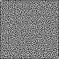
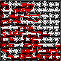
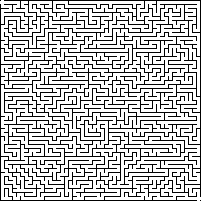
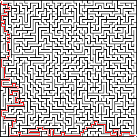
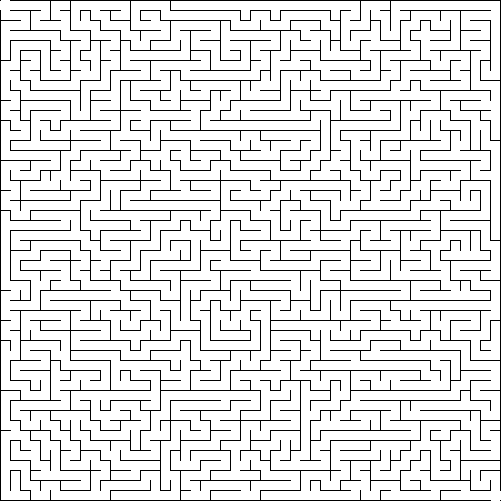
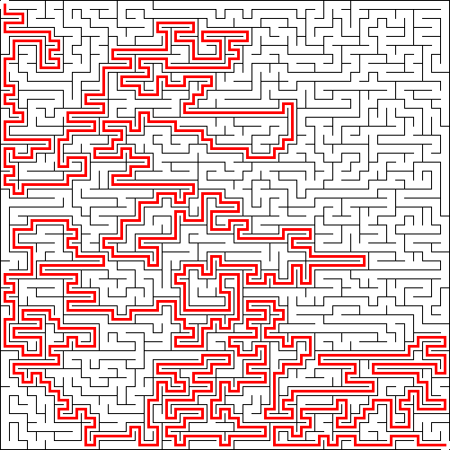
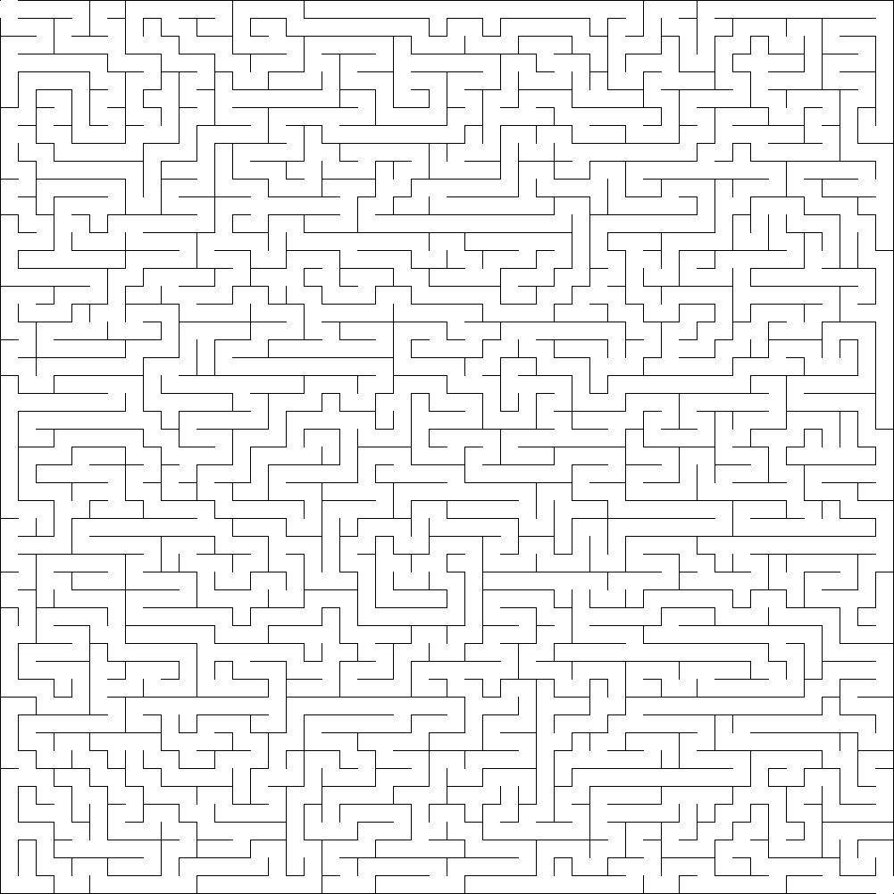
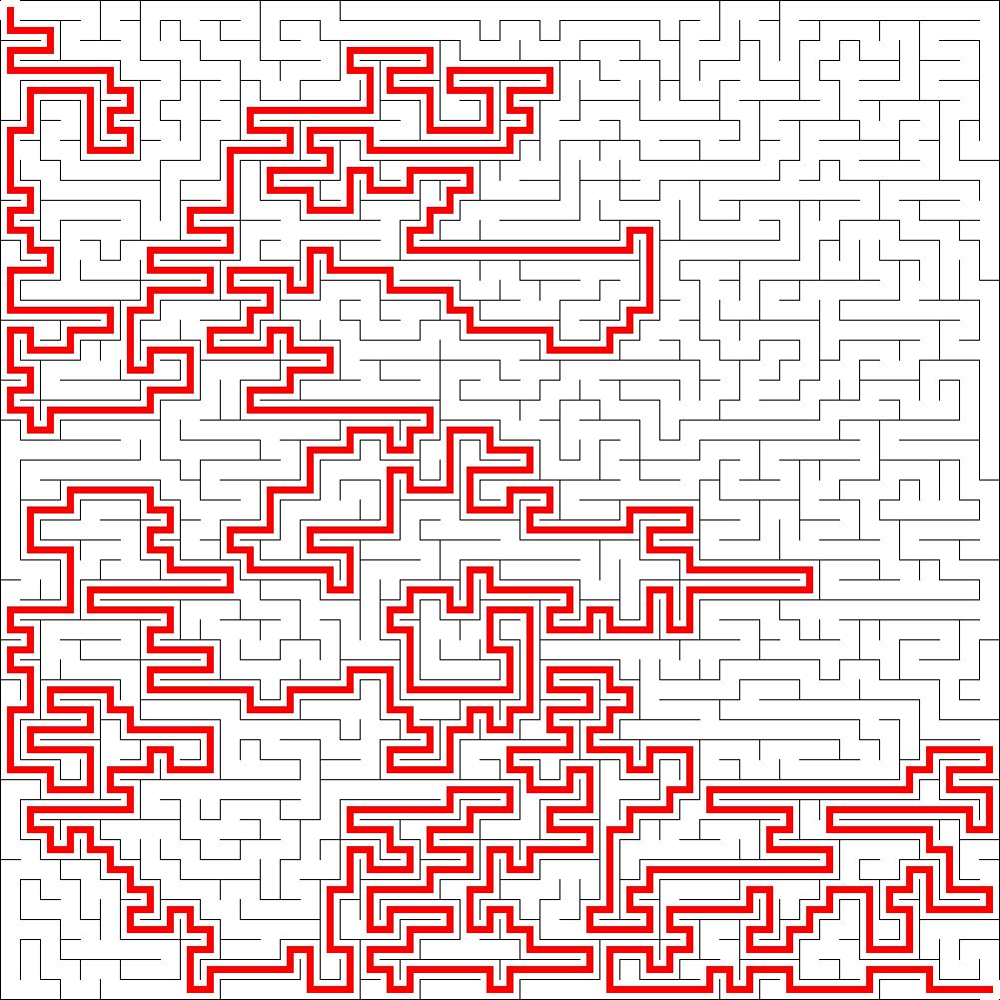

# Size Examples - Design of Experiments

## Experiment Overview

This document demonstrates how **image resolution** affects maze visualization using a Design of Experiments (DOE) approach. All parameters are held constant except for the image output resolution, allowing us to observe the impact of rendering resolution on visual clarity and detail.

### Purpose
To understand how different image resolutions affect the visual appearance and clarity of the same maze structure.

## Experimental Setup

### Fixed Parameters
- **Maze Dimensions**: 50×50 cells (medium size)
- **Complexity**: 0.5 (fixed)
- **Algorithm**: recursive_backtracking (default)
- **Seed**: 12345 (for reproducibility - ensures identical maze structure across all resolutions)

### Variable Parameter
- **Image Resolution**: Controlled via `cell_size` parameter
  - `cell_size` determines pixels per cell
  - Final image dimensions = (maze_width × cell_size + 1) × (maze_height × cell_size + 1)

### Test Cases

| Image Size (pixels) | cell_size | Command/Config |
|---------------------|-----------|----------------|
| 50×50               | 1         | `cell_size = 1` |
| 100×100             | 2         | `cell_size = 2` |
| 200×200             | 4         | `cell_size = 4` |
| 500×500             | 10        | `cell_size = 10` |
| 1000×1000           | 20        | `cell_size = 20` |

## Generating the Examples

Since `cell_size` is currently only configurable via `config.toml` (not available as a CLI argument), you have two options:

### Method 1: Modify config.toml for Each Run

1. Edit `config.toml` and set the desired `cell_size` value
2. Run the generator with fixed parameters:

```bash
# For 50×50 pixel image (cell_size = 1)
# Edit config.toml: cell_size = 1
./target/release/maze_generator \
  --width 50 \
  --height 50 \
  --complexity 0.5 \
  --seed 12345 \
  --output size_example_50x50.png

# For 100×100 pixel image (cell_size = 2)
# Edit config.toml: cell_size = 2
./target/release/maze_generator \
  --width 50 \
  --height 50 \
  --complexity 0.5 \
  --seed 12345 \
  --output size_example_100x100.png

# For 200×200 pixel image (cell_size = 4)
# Edit config.toml: cell_size = 4
./target/release/maze_generator \
  --width 50 \
  --height 50 \
  --complexity 0.5 \
  --seed 12345 \
  --output size_example_200x200.png

# For 500×500 pixel image (cell_size = 10)
# Edit config.toml: cell_size = 10
./target/release/maze_generator \
  --width 50 \
  --height 50 \
  --complexity 0.5 \
  --seed 12345 \
  --output size_example_500x500.png

# For 1000×1000 pixel image (cell_size = 20)
# Edit config.toml: cell_size = 20
./target/release/maze_generator \
  --width 50 \
  --height 50 \
  --complexity 0.5 \
  --seed 12345 \
  --output size_example_1000x1000.png
```

### Method 2: Create Separate Config Files

Create individual config files for each resolution:

**config_size_50.toml:**
```toml
width = 50
height = 50
algorithm = "recursive_backtracking"
complexity = 0.5
output = "size_example_50x50.png"
cell_size = 1
seed = 12345
```

**config_size_100.toml:**
```toml
width = 50
height = 50
algorithm = "recursive_backtracking"
complexity = 0.5
output = "size_example_100x100.png"
cell_size = 2
seed = 12345
```

**config_size_200.toml:**
```toml
width = 50
height = 50
algorithm = "recursive_backtracking"
complexity = 0.5
output = "size_example_200x200.png"
cell_size = 4
seed = 12345
```

**config_size_500.toml:**
```toml
width = 50
height = 50
algorithm = "recursive_backtracking"
complexity = 0.5
output = "size_example_500x500.png"
cell_size = 10
seed = 12345
```

**config_size_1000.toml:**
```toml
width = 50
height = 50
algorithm = "recursive_backtracking"
complexity = 0.5
output = "size_example_1000x1000.png"
cell_size = 20
seed = 12345
```

Then run each with:
```bash
./target/release/maze_generator --config config_size_50.toml
./target/release/maze_generator --config config_size_100.toml
./target/release/maze_generator --config config_size_200.toml
./target/release/maze_generator --config config_size_500.toml
./target/release/maze_generator --config config_size_1000.toml
```

## Size Examples

The following examples demonstrate the same maze structure (50×50 cells, seed 12345) rendered at different resolutions. All examples use the recursive_backtracking algorithm with complexity 0.5.

### Resolution Comparison

| Image Size (pixels) | cell_size | Unsolved Maze | Solved Maze |
|---------------------|-----------|---------------|-------------|
| 50×50 | 1 |  |  |
| 100×100 | 2 |  |  |
| 200×200 | 4 |  |  |
| 500×500 | 10 |  |  |
| 1000×1000 | 20 |  |  |

## Expected Results

### Visual Impact of Resolution

1. **50×50 pixels (cell_size = 1)**
   - Very low resolution
   - Individual cells may be difficult to distinguish
   - Useful for thumbnails or icons
   - Solution path may be barely visible

2. **100×100 pixels (cell_size = 2)**
   - Low resolution
   - Basic structure visible but details are limited
   - Suitable for small previews

3. **200×200 pixels (cell_size = 4)**
   - Medium-low resolution
   - Maze structure clearly visible
   - Good balance between file size and clarity
   - Solution path visible but may appear thick

4. **500×500 pixels (cell_size = 10)**
   - Medium-high resolution
   - Clear detail and good visual quality
   - Recommended for most use cases
   - Solution path clearly visible with appropriate thickness

5. **1000×1000 pixels (cell_size = 20)**
   - High resolution
   - Excellent detail and clarity
   - Best for printing or detailed analysis
   - Solution path appears thin and precise
   - Larger file size

### Key Observations

- **Lower resolutions** (50×50, 100×100): 
  - Smaller file sizes
  - Faster rendering
  - Less detail, may appear pixelated
  - Solution path may be too thick relative to cell size

- **Higher resolutions** (500×500, 1000×1000):
  - Larger file sizes
  - More detail and clarity
  - Better for printing or detailed viewing
  - Solution path appears more proportional

- **Optimal resolution** depends on use case:
  - Web thumbnails: 100×100 to 200×200
  - General viewing: 500×500
  - Printing/detailed analysis: 1000×1000 or higher

## Notes

- All generated mazes will have **identical structure** (same seed ensures reproducibility)
- Only the **visual representation** changes with resolution
- The solved versions (`*_solved.png`) will also be generated automatically
- Solution line thickness scales with `cell_size` (default: 1/3 of cell_size)

